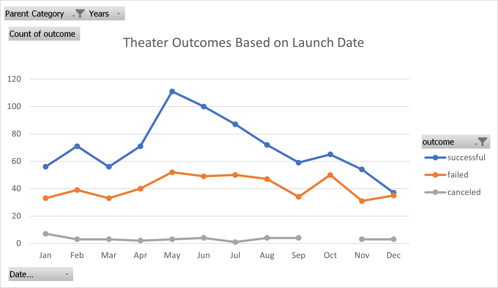
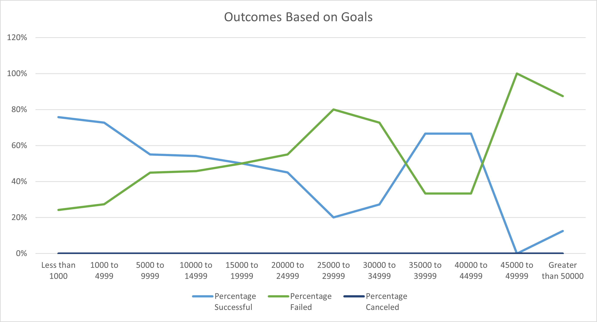

# Kickstarting with Excel

## Overview of Project

Use Excel to analyze and visualized data from Kickstarter in order to advise customer on how different variables, such as, launch date, goals affect funding outcomes for Plays on the Kickstarter platform.

## Analysis and Challenges

### Analysis of Outcomes Based on Launch Date

Grouping all campaigns by months we see that more campaigns are being launched in the months of May, June and July.  With these months showing significant higher number of successful campaigns. This could be an early indication that the late spring/early summer period is a desirable time to launch a theater type campaign on Kickstarter.

### Analysis of Outcomes Based on Goals

Looking at outcomes based on goals we can notice that campaigns for plays with a funding goal less than $5,000, have a higher percentage of successful outcomes. The percentage of successful campaigns start to progressively decrease as the funding goal increase over $5,000. Based on this pattern a campaign with a funding goal of less than $5,000 is more likely to succussed.

The Funding range between $35,000 and $44,999 sees an increase of the successful outcomes as percentage of total projects (67%), but since the total number of projects in this range is so low, the data is not sufficient to infer the likelihood of campaigns in this range to be successful.

### Challenges and Difficulties Encountered

My main difficulty in this assigment is the 

### Results

**What are two conclusions you can draw about the Outcomes based on Launch Date?**
* May is the most popular month to launch campaigns, and it also has the higher number of successful campaigns.
* December is the worst month to launch a campaign, since it presents the lowest number of campaigns launch and a similar number of successful vs failed campaigns.

**What can you conclude about the Outcomes based on Goals?**

Reviewing the outcomes based on goals we can determine that campaigns with goals under $5000 have higher probability of successfully achiving funding goals.

**What are some limitations of this dataset?**
* The data shows outcomes for many countries, being that theater/plays tend to be local in scope, there is a limitation in how relevant data from markets outside the intended market is.
* We do not know if this is a complete dataset for the date range or it is a sample.
* The dataset end first quarter of 2017, it might be outdated for analysis in 2021.

**What are some other possible tables and/or graphs that we could create?**
* Table showing the number of different outcomes based on campaigns length.
* Bar graph of average donation (split into ranges) in successful campaigns.
