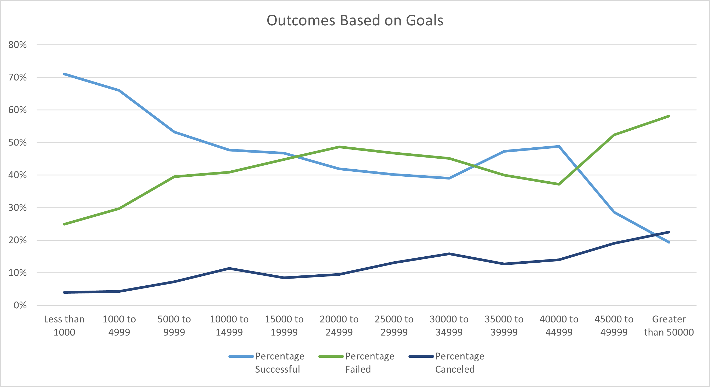

# Kickstarting with Excel

## Overview of Project

Use Excel to analyze and visualized data from Kickstarter in order to advise customer on how different variables, such as, launch date, goals affect funding outcomes for Plays on the Kickstarter platform.

## Analysis and Challenges

### Analysis of Outcomes Based on Launch Date

Grouping all campaigns by months we see that more campaigns are being launched in the months of May, June and July.  With these months showing significant higher number of successful campaigns. This could be an early indication that the late spring/early summer period is a desirable time to launch a theater type campaign on Kickstarter.

### Analysis of Outcomes Based on Goals

Looking at outcomes based on goals we can notice that campaigns for plays with a funding goal less than $5,000, have a higher percentage of successful outcomes. The percentage of successful campaigns start to progressively decrease as the funding goal increase over $5,000. Based on this pattern a campaign with a funding goal of less than $5,000 is more likely to succussed.
The Funding range between $35,000 and $44,999 sees an increase of the successful outcomes as percentage of total projects (67%), but since the total number of projects in this range is so low, the data is not sufficient to infer the likelihood of campaigns in this range to be successful.

